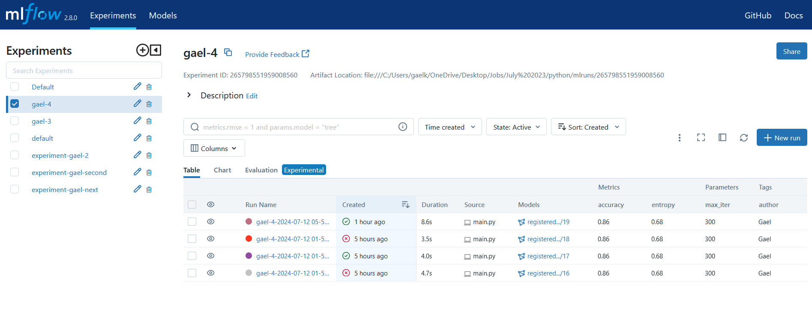

# Training and Serving machine learning with MLflow

## Install
* *pip install -r requirements* *

## Run de code 

- In the commant prompt start de MLflow server: mlflow ui

- Access the server locally from the browser by going to this url: * *http://127.0.0.1:5000* *
You can also host the server on a cloud provider (Google Clouds, AWS or Azure)

- In another command promt window run the script below:

* *python main.py --dataset "MLOps_test" --experiment "new_experiment" --max_iter 200 --random_seed 42 --author "Gael"  --purpose "assignment" --tracking_uri "http://127.0.0.1:5000"* *

The arguments are optional but their default values are indicated in main.py. By default the dataset is in the folder MLOps.
You can just start a training by running * *python main.py* *

